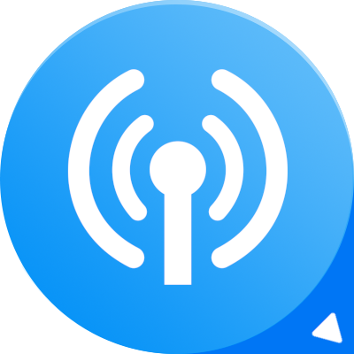
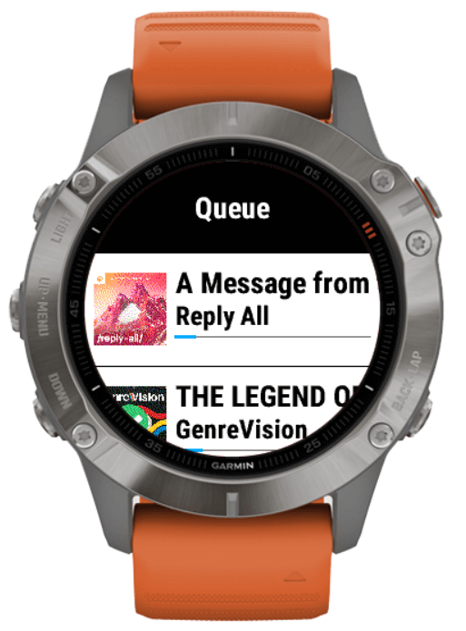

# Garmin Podcasts

*Garmin Podcasts* is a Garmin Connect IQ podcast app powered by [Podcast Index](https://podcastindex.org). No external service or subscription required: all you need is you watch!

Download your favorite episodes or keep your up-to-date with the most recent ones, organize your queue and resume listening from where you left.

## Features

- Free and Open Source
- No external service or subscription required, just your watch!
- [gpodder.net](https://gpodder.net/) support
- Subscription management
- Configurable playback queue
- Episode progress tracking, resume from where you left

## How to build

1. Download the latest version of [Garmin Connect IQ SDK](https://developer.garmin.com/connect-iq/sdk/);
2. Get a [Podcast Index API token](https://api.podcastindex.org/);
3. Set the API token and secret in `app/source/Secrets.mc.example` and save it as `app/source/Secrets.mc`.

## Screenshots

  
  
  

## Links
- [How to use](https://lucasasselli.github.io/garmin-podcasts/how-to-use.html)
