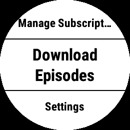
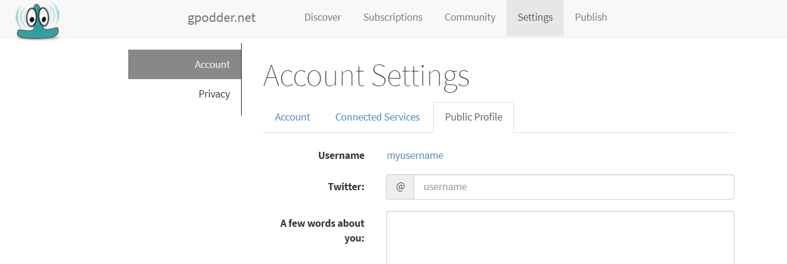

  * [Getting Started](#getting-started)
  * [Downloading episodes](#downloading-episodes)
  * [Playback queue](#playback-queue)
  * [Advanced settings](#advanced-settings)
    + [Getting your subscriptions from gpodder](#getting-your-subscriptions-from-gpodder)
    + [Downloading recent episodes automatically](#downloading-recent-episodes-automatically)

## Getting Started



In order to start using _Podcast_, you need to set it as your device Music Provider. 

1. On your device, access the music player from the music widget or by holding the down key
2. Press the menu key
3. Select **Manage** (gear icon)
4. Select **Music Providers**
5. Select **Podcasts**

  
   
  

## Downloading episodes

First of all, to listen to podcasts, you need podcasts to listen! To subscribe to a podcast navigate to the app main menu:

1. Select **Podcasts**
2. Select **Search**
3. Enter the title of the feed you want to subscribe
4. Select a podcast from the results
5. Select yes when prompted

   
  
  

To download episodes, from the main menu:

1. Select **Sync**
2. Select a podcast from the list
3. Check the episodes you want to download, or uncheck the episodes you want to remove
5. When you are done, press back or select **Done**
6. To start the download, from the podcast menu, press back and select yes when prompted

   
  



## Playback queue

To manage the playback queue, from the main menu:

1. Select **Playback queue**
2. Check the episodes you want to add to the queue, uncheck the ones you don't want to listen now
3. When you are done, press back

At this point you will be prompted to start the playback immediately, select yes if you are ready, or no if you want to do it later. 
Your queue will wait for you in your device player.

## Advanced settings

### Getting your subscriptions from gpodder

By default, _Podcasts_ manages the subscriptions directly from your Garmin device, but optionally subscriptions you can download subscriptions from a gpodder.net account.



To enable gpodder as the podcast provider, in the app settings (either in Connect IQ or directly on your watch), set **Subscription service** to _gpodder.net_. 
From Garmin Connect IQ app set your **Username** and **Password**. 

  

  

### Downloading recent episodes automatically

Instead of selecting individual episodes each time you sync, _Podcasts_ can automatically download the most recent ones for each feed.

In the app settings (either in Connect IQ or directly on your watch), set **Sync Mode** to _Most Recent_ and select the number of episodes to download for each podcast using the **Episodes per Podcast** setting. 
To avoid long synchronizations, the numbers of episodes downloaded is limited to the **Max. Episodes** setting.
